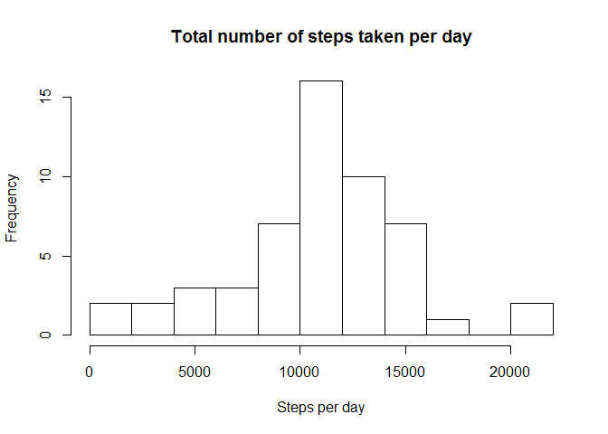
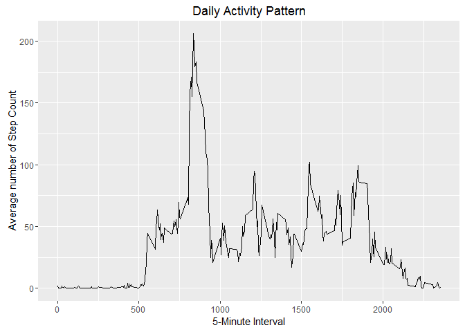
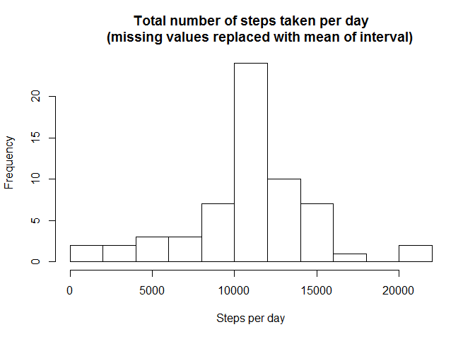
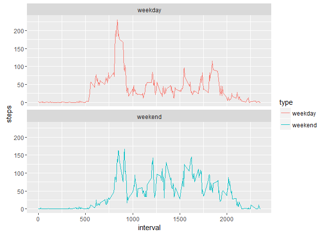

# Reproducible Research: Peer Assessment 1


## Loading and preprocessing the data

```r
if (!file.exists("activity.csv")) {
  unzip("activity.zip")
}
activity <- read.csv("activity.csv", colClass=c('integer', 'Date', 'integer')) 
str(activity)
```

```
## 'data.frame':	17568 obs. of  3 variables:
##  $ steps   : int  NA NA NA NA NA NA NA NA NA NA ...
##  $ date    : Date, format: "2012-10-01" "2012-10-01" ...
##  $ interval: int  0 5 10 15 20 25 30 35 40 45 ...
```

```r
head(activity)
```

```
##   steps       date interval
## 1    NA 2012-10-01        0
## 2    NA 2012-10-01        5
## 3    NA 2012-10-01       10
## 4    NA 2012-10-01       15
## 5    NA 2012-10-01       20
## 6    NA 2012-10-01       25
```

## What is mean total number of steps taken per day?
For this part of the assignment, ignore the missing values in the dataset.

1. Calculate the total number of steps taken per day

```r
stepsPerDay <- tapply(activity$steps, activity$date, sum)
```

2. Make a histogram of the total number of steps taken per day.


```r
hist(stepsPerDay,breaks=10,main = "Total number of steps taken per day", xlab = "Steps per day")
```



3. Calculate and report the mean and median of the total number of steps taken per day

```r
mean(stepsPerDay,na.rm = TRUE)
```

```
## [1] 10766.19
```

```r
median(stepsPerDay,na.rm = TRUE)
```

```
## [1] 10765
```

The mean value is 
## What is the average daily activity pattern?

1. Make a time series plot (i.e. type = "l") of the 5-minute interval (x-axis) and the average number of steps taken, averaged across all days (y-axis)


```r
library(plyr)
# Calculate average steps for each of 5-minute interval during a 24-hour period
dailyActivity <- ddply(na.omit(activity),~interval, summarise, mean=mean(steps))
library(ggplot2)
qplot(x=interval, y=mean, data = dailyActivity,  geom = "line",
      xlab="5-Minute Interval",
      ylab="Average number of Step Count",
      main="Daily Activity Pattern")
```



2. Which 5-minute interval, on average across all the days in the dataset, contains the maximum number of steps?

```r
dailyActivity[which.max(dailyActivity$mean),]
```

```
##     interval     mean
## 104      835 206.1698
```

## Imputing missing values
Note that there are a number of days/intervals where there are missing values (coded as NA). The presence of missing days may introduce bias into some calculations or summaries of the data.

1. Calculate and report the total number of missing values in the dataset (i.e. the total number of rows with NAs)

```r
sum(is.na(activity))
```

```
## [1] 2304
```
Total number of missing values is 2304.

2. Devise a strategy for filling in all of the missing values in the dataset. The strategy does not need to be sophisticated. 
3. Create a new dataset that is equal to the original dataset but with the missing data filled in.

```r
new_activity <- activity
nas <- is.na(new_activity$steps)
avg_interval <- tapply(new_activity$steps,new_activity$interval, mean, na.rm=TRUE, simplify=TRUE)
new_activity$steps[nas] <- avg_interval[as.character(new_activity$interval[nas])]

sum(is.na(new_activity))
```

```
## [1] 0
```

There is no missing value.

4. Make a histogram of the total number of steps taken each day and Calculate and report the mean and median total number of steps taken per day.

```r
new_stepsPerDay <- tapply(new_activity$steps, new_activity$date, sum)
hist(new_stepsPerDay,breaks=10,main = "Total number of steps taken per day
     (missing values replaced with mean of interval)", xlab = "Steps per day")
```



```r
mean(new_stepsPerDay,na.rm = TRUE)
```

```
## [1] 10766.19
```

```r
median(new_stepsPerDay,na.rm = TRUE)
```

```
## [1] 10766.19
```
The impact of imputing missing data with the average number of steps in the same 5-min interval is that both the mean and the median are equal to the same value: 10766.

## Are there differences in activity patterns between weekdays and weekends?
1. Create a new factor variable in the dataset with two levels – “weekday” and “weekend” indicating whether a given date is a weekday or weekend day.


```r
new_activity <- mutate(new_activity, type = ifelse(weekdays(new_activity$date) %in% c ("Saturday", "Sunday"), "weekend", "weekday"))
new_activity$type <- as.factor(new_activity$type)
head(new_activity)
```

```
##       steps       date interval    type
## 1 1.7169811 2012-10-01        0 weekday
## 2 0.3396226 2012-10-01        5 weekday
## 3 0.1320755 2012-10-01       10 weekday
## 4 0.1509434 2012-10-01       15 weekday
## 5 0.0754717 2012-10-01       20 weekday
## 6 2.0943396 2012-10-01       25 weekday
```

2. Make a panel plot containing a time series plot (i.e. type = "l") of the 5-minute interval (x-axis) and the average number of steps taken, averaged across all weekday days or weekend days (y-axis). 

```r
library(dplyr)
```

```
## 
## Attaching package: 'dplyr'
```

```
## The following objects are masked from 'package:plyr':
## 
##     arrange, count, desc, failwith, id, mutate, rename, summarise,
##     summarize
```

```
## The following objects are masked from 'package:stats':
## 
##     filter, lag
```

```
## The following objects are masked from 'package:base':
## 
##     intersect, setdiff, setequal, union
```

```r
new_dailyActivity <- new_activity %>%
  group_by(interval,type)%>%
  summarise(steps= mean(steps))
ggplot(data = new_dailyActivity,aes(x=interval, y=steps,color = type))+
      geom_line()+
      facet_wrap(~type, ncol = 1, nrow=2)
```



From the two graphs, it shows that the test object is more active earlier in the day during weekdays than the weekends. While, more active throughout the weekends compared with weekdays.
